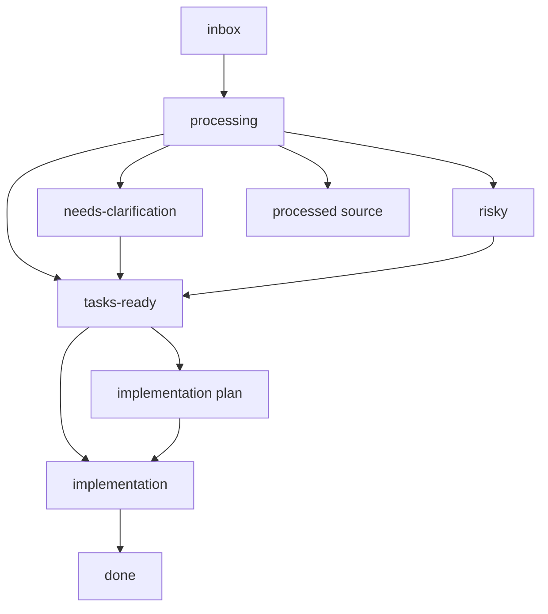

# Backlog Agent Rules

## Scope

Applies to all tasks inside `backlog/` together with the root `AGENTS.md`.
Backlog files are workflow artifacts, not project-code implementation.

---

## Status directories

- `inbox/` -> untriaged source notes
- `processing/` -> temporary triage workspace
- `processed/` -> preserved source notes after triage
- `tasks-ready/` -> current tasks with sufficient requirements
- `risky/` -> current tasks requiring explicit security, domain, data, or runtime review
- `needs-clarification/` -> current tasks with blocking product or architecture questions
- `implementation-plans/` -> plans for unfinished tasks; a plan does not start implementation
- `implementation/` -> tasks explicitly placed into active implementation
- `done/` -> completed tasks and their completed implementation plans
- `logs/` -> append-only triage, planning, implementation, and status-audit evidence
- `mockups/` -> backlog-owned visual references linked from tasks

---

## Workflow invariants

- Preserve the original source note and traceability when creating or merging tasks.
- Prevent duplicate active tasks; reconcile against current code, tests, plans,
  and done items before creating a new card.
- The status recorded in a card must match its status directory.
- A task with blocking questions does not remain in `tasks-ready/`, `risky/`,
  or `implementation/`.
- A risky task does not move to implementation until its required review and
  stop conditions are explicit.
- Creating a plan does not imply that implementation has started.
- Moving a completed task to `done/` also moves its completed plan there.
- Preserve historical logs; append corrections or status updates instead of
  rewriting evidence that informed earlier decisions.
- Do not change project code while performing capture, triage, reconciliation,
  or planning unless the user separately authorizes implementation.

The global `зафиксируй` and `зафикчируй` capture trigger is defined in the root
`AGENTS.md` and applies before triage.

---

## Required validation

For backlog changes:

- verify every referenced file and task ID exists or is explicitly marked external;
- verify card status and directory agree;
- verify implementation plans link to the intended task and branch;
- verify completed task/plan pairs are colocated in `done/`;
- report unresolved duplicates, stale statuses, and blocking questions rather
  than guessing their resolution.

---

## Code review rules

Flag lost source traceability, duplicate active tasks, status/directory drift,
plans presented as active implementation, risky work missing review gates, and
completed artifacts left in active directories.
